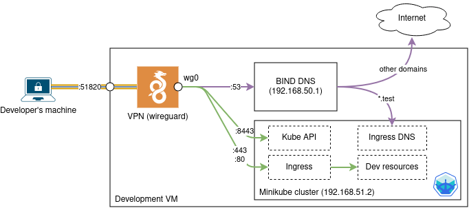

# NaaVRE development VM

A VM to run https://github.com/QCDIS/NaaVRE-dev-environment

## Overview

This repo contains configuration for a VM intended to run the [NaaVRE-dev-environment](https://github.com/QCDIS/NaaVRE-dev-environment). This allows developers to spend less time setting up a development environment on their own machines.

The VM runs:

- a minikube cluster (at 192.168.51.2)
- a DNS that can resolve both public domain names and `.test` domains defined in ingress rules (at 192.168.50.1)
- a Wireguard VPN to access the above resources from any remote machine

When connected to the Wireguard VPN, traffic to 192.168.50.0/24, 192.168.51.0/24 as well as DNS requests go through the tunnel. Traffic to other local addresses and the rest of the internet is unaffected.



## Deploying the VM (for administrators)

**Step 1:** Create a VM

- Recommended: 4 vCPU, 8 GB RAM, 50 GB volume
- Image: Ubuntu 22.04
- Networking rules: allow incoming SSH and wireguard (22/tcp and 51820/udp)

**Step 2:** Configure the VM

```shell
ansible-playbook -u ubuntu -i "IP," playbooks/all.yaml
```

**Step 3:** Retrieve the wireguard and kubeconfig files

```shell
scp ubuntu@IP:naavre-dev-vm-kubeconfig .
scp ubuntu@IP:naavre-dev-vm.conf .
```

and send them to the developer.

**Step 4 (optional):** give SSH access to the developer.


## Using the VM (for developers)

### Connect to the Wireguard VPN

First, install Wireguard ([documentation](https://www.wireguard.com/install/)).

You then have two options:
- Connect directly by running the command: `wg-quick up naavre-dev-vm.conf` (recommended where possible). To disconnect, run `wg-quick down naavre-dev-vm.conf`.
- Import `naavre-dev-vm.conf` in your wireguard client, or add the configuration manually.

Check the connection with the minikube cluster running on the VM:

```shell
$ ping 192.168.51.2
PING 192.168.51.2 (192.168.51.2) 56(84) bytes of data.
64 bytes from 192.168.51.2: icmp_seq=1 ttl=63 time=6.84 ms
64 bytes from 192.168.51.2: icmp_seq=2 ttl=63 time=5.75 ms
...
```

### Configure access to the minikube cluster running on the VM

Install `kubectl` ([documentation](https://kubernetes.io/docs/tasks/tools/install-kubectl-linux/)). (*Note:* if you are using [NaaVRE-dev-environment](https://github.com/QCDIS/NaaVRE-dev-environment), `kubectl` is already installed in the conda environment.)

Copy `naavre-dev-vm-kubeconfig` to `~/.kube/config`. (**Warning:** if you already have clusters configured in your `~/.kube/config`, you need to merge the files and set the current context to `naavre-dev-vm`.)

Check the connection with the kube API:

```shell
$ kubectl get no
NAME            STATUS   ROLES           AGE   VERSION
naavre-dev-vm   Ready    control-plane   56m   v1.30.0
```

### Use the minikube cluster in Tilt

To deploy resources to the minikube cluster with Tilt, add the following line at the beginning of your `Tiltfile` (e.g. the `Tiltfile` at the root of [NaaVRE-dev-environment](https://github.com/QCDIS/NaaVRE-dev-environment):

```
allow_k8s_contexts('naavre-dev-vm')
```

You can then use the usual tilt commands. Resources will be deployed to the minikube cluster running on the VM.